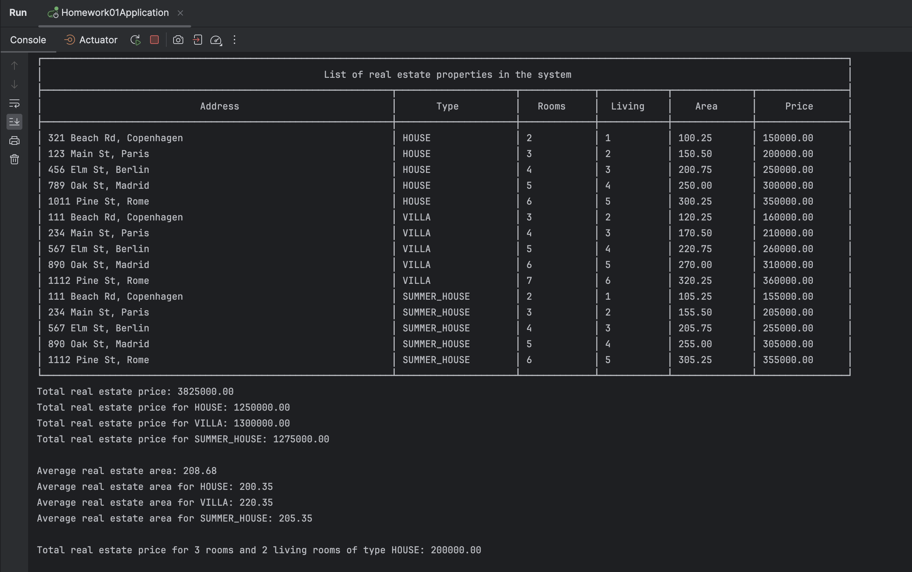

# Patika.dev - Homework 01

This repository contains the first Spring Boot homework assignment provided by **Patika.dev** within the **n11 TalentHub Backend Bootcamp**. The application demonstrates different types of real estate properties such as houses, villas, and summer houses. It provides functionalities to calculate total prices, average area, and filter properties based on specific criteria.

## Entities

- [**RealEstate**](src/main/java/com/selimsahin/homework01/entity/RealEstate.java): An abstract class representing a generic real estate property. It contains common attributes like ID, address, price, number of rooms, number of living rooms, and area. Subclasses include:
  - [**House**](src/main/java/com/selimsahin/homework01/entity/House.java): Represents a house property.
  - [**Villa**](src/main/java/com/selimsahin/homework01/entity/Villa.java): Represents a villa property.
  - [**SummerHouse**](src/main/java/com/selimsahin/homework01/entity/SummerHouse.java): Represents a summer house property.

## Service

- [**RealEstateService**](src/main/java/com/selimsahin/homework01/service/RealEstateService.java): An interface defining operations related to real estate management such as calculating total price by type, total price overall, average area by type, and filtering properties by room and living room count.

## Implementation

- [**RealEstateServiceImpl**](src/main/java/com/selimsahin/homework01/service/RealEstateServiceImpl.java): Provides the implementation for the `RealEstateService` interface.

## Enums

- [**RealEstateType**](src/main/java/com/selimsahin/homework01/enums/RealEstateType.java): An enum defining different types of real estate properties: `HOUSE`, `VILLA`, and `SUMMER_HOUSE`.

## Console Output

The system's functionalities can be demonstrated through console output. Below is a screenshot of the console output showcasing the various operations performed by the system:



## Usage

To use this Real Estate Management System, you can follow these steps:

1. Clone the repository to your local machine:

   ```bash
   git clone https://github.com/your-username/real-estate-management.git
   ```
2. Compile and run the Java application using your favorite IDE or command line tools.
3. Explore the functionalities provided by the system by observing the console output.

<br />
<br />

**Author:** [**selimsahindev**](https://github.com/selimsahindev/)
